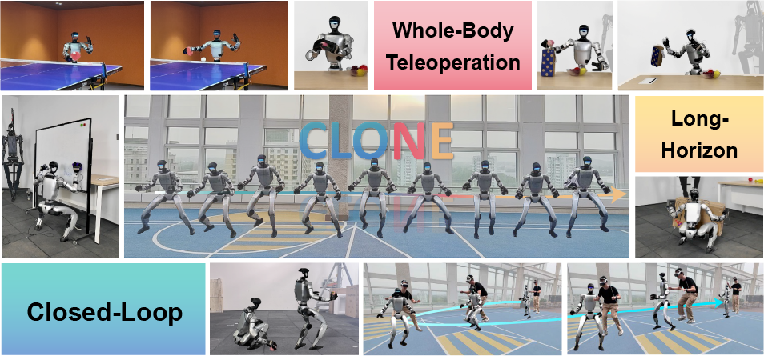

[](https://player.vimeo.com/video/1092360484?h=1c4f4e6711)
<div id="top" align="left">

[](https://arxiv.org/abs/2506.08931)
[](https://humanoid-clone.github.io/)
[](https://github.com/humanoid-clone/CLONE/blob/main/README.md)
[](https://player.vimeo.com/video/1092360484?h=1c4f4e6711)
[](https://yutang-lin.github.io/blog/)
</div>

# CLONE

## 🔥 News

- \[2025-07\] We release CLONE's early checkpoint and [deploy document](https://github.com/humanoid-clone/CLONE/blob/main/deploy/README.md).

- \[2025-06\] We release the [paper](https://arxiv.org/abs/2506.08931) and [demos]().


## 🏠 About

<!--  -->

CLONE employs an MoE-based policy with <b>closed-loop error correction</b> for holistic humanoid teleoperation, enabling capabilities previously unattainable with existing systems—such as <b>whole-body coordination</b> and <b>long-horizon task execution</b>.
Using only minimal input from a commercial MR headset, CLONE significantly improves tracking precision over existing open-loop approaches, opening new possibilities for practical humanoid deployment in unstructured environments.


<!-- ## 📚 Getting Started

### Prerequisites


### Installation


### Training and Deployment -->


## 📝 TODO List

- \[x\] Release the paper with demos.
- \[x\] Release early checkpoints(used for real-world deployment).
- \[x\] Release instructions for real-world deployment.
- \[ \] Release training and inference code with [**Roboverse**](https://github.com/RoboVerseOrg/RoboVerse).
- \[ \] Release enhanced checkpoints.
- \[ \] Release evaluation code.
- \[ \] Release training code.
- \[ \] Full release and further updates.


## 🔗 Citation

If you find our work helpful, please cite:

```bibtex
@misc{li2025clone,
  title={CLONE: Closed-Loop Whole-Body Humanoid Teleoperation for Long-Horizon Tasks}, 
  author={Yixuan Li and Yutang Lin and Jieming Cui and Tengyu Liu and Wei Liang and Yixin Zhu and Siyuan Huang},
  journal={arXiv preprint arXiv:2506.08931}, 
  year={2025}
}
```
You may also find CLONE's implementation in [RoboVerse](https://github.com/RoboVerseOrg/RoboVerse).

</details>

## 📄 License

This project is released under [CC BY-NC 4.0 license](https://creativecommons.org/licenses/by-nc/4.0/deed.en).


## 👏 Acknowledgements
- [RoboVerse](https://github.com/RoboVerseOrg/RoboVerse): Together with the RoboVerse team, we release the training and inference code.
- [PHC](https://github.com/ZhengyiLuo/PHC): We use PHC for reference motion retargeting.
- [OmniH2O](https://github.com/LeCAR-Lab/human2humanoid): We use OmniH2O as our codebase.
- [FAST_LIO](https://github.com/LeCAR-Lab/human2humanoid): We use the FAST_LIO as the Lidar Odometry.
- [VisionProTeleop](https://github.com/Improbable-AI/VisionProTeleop): We use VisionProTeleop to teleoperate with Apple VisionPro.
